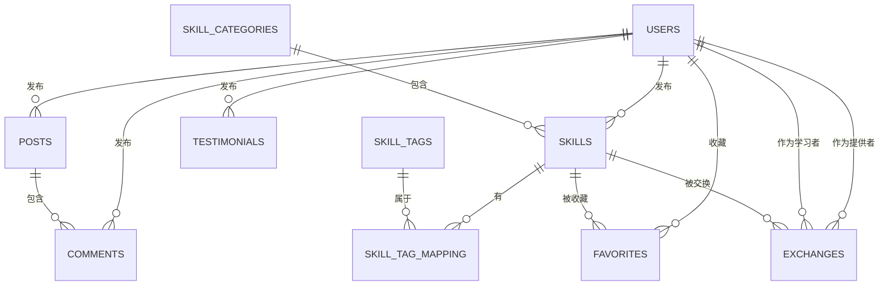

# 数据库表结构文档

本文档详细描述了技能交换平台所使用的数据库表结构，旨在为开发人员提供足够的信息进行开发，而无需直接访问数据库。

## 1. `users` 表

**描述:** 存储平台用户的基本信息。

| 列名          | 数据类型       | 约束                               | 描述                       |
| :------------ | :------------- | :--------------------------------- | :------------------------- |
| `user_id`     | INT            | PRIMARY KEY, AUTO_INCREMENT        | 用户唯一标识符             |
| `username`    | VARCHAR(50)    | NOT NULL                           | 用户昵称                   |
| `email`       | VARCHAR(100)   | NOT NULL, UNIQUE                   | 用户注册邮箱，用于登录和联系 |
| `password_hash` | VARCHAR(255)   | NOT NULL                           | 哈希加密后的用户密码       |
| `school`      | VARCHAR(100)   |                                    | 用户所在学校（可选）       |
| `major`       | VARCHAR(100)   |                                    | 用户所学专业（可选）       |
| `avatar_url`  | VARCHAR(255)   |                                    | 用户头像图片的URL（可选）  |
| `bio`         | TEXT           |                                    | 用户个人简介（可选）       |
| `created_at`  | DATETIME       | DEFAULT CURRENT_TIMESTAMP          | 记录创建时间               |
| `updated_at`  | DATETIME       | DEFAULT CURRENT_TIMESTAMP ON UPDATE CURRENT_TIMESTAMP | 记录最后更新时间           |

**索引:**
*   `PRIMARY KEY` on (`user_id`)
*   `UNIQUE KEY` on (`email`)

## 2. `skill_categories` 表

**描述:** 存储技能的分类信息。

| 列名          | 数据类型       | 约束                          | 描述                       |
| :------------ | :------------- | :---------------------------- | :------------------------- |
| `category_id` | INT            | PRIMARY KEY, AUTO_INCREMENT   | 分类唯一标识符             |
| `name`        | VARCHAR(50)    | NOT NULL, UNIQUE              | 分类名称 (例如: 编程开发)  |
| `description` | TEXT           |                               | 分类描述信息（可选）       |
| `icon_url`    | VARCHAR(255)   |                               | 分类图标的URL（可选）      |
| `skill_count` | INT            | DEFAULT 0                     | 该分类下的技能数量（冗余字段，可能需要触发器或应用逻辑维护） |

**索引:**
*   `PRIMARY KEY` on (`category_id`)
*   `UNIQUE KEY` on (`name`)

## 3. `skills` 表

**描述:** 存储用户发布的技能信息，是平台的核心表之一。

| 列名                 | 数据类型       | 约束                               | 描述                                           |
| :------------------- | :------------- | :--------------------------------- | :--------------------------------------------- |
| `skill_id`           | INT            | PRIMARY KEY, AUTO_INCREMENT        | 技能唯一标识符                                 |
| `user_id`            | INT            | NOT NULL                           | 发布该技能的用户ID                             |
| `category_id`        | INT            | NOT NULL                           | 该技能所属的分类ID                             |
| `title`              | VARCHAR(100)   | NOT NULL                           | 技能标题                                       |
| `description`        | TEXT           | NOT NULL                           | 技能详细描述                                   |
| `teaching_method`    | TEXT           |                                    | 教授方式描述（可选，例如：线上、线下、项目）   |
| `exchange_expectation` | TEXT           |                                    | 期望交换的技能或条件描述（可选）               |
| `rating`             | DECIMAL(3,1)   | DEFAULT 0.0                        | 技能的平均评分（例如：0.0 - 5.0）              |
| `exchange_count`     | INT            | DEFAULT 0                          | 该技能成功交换的次数                           |
| `view_count`         | INT            | DEFAULT 0                          | 技能被浏览的次数                               |
| `is_active`          | BOOLEAN        | DEFAULT TRUE                       | 技能是否处于活跃可交换状态                     |
| `created_at`         | DATETIME       | DEFAULT CURRENT_TIMESTAMP          | 记录创建时间                                   |
| `updated_at`         | DATETIME       | DEFAULT CURRENT_TIMESTAMP ON UPDATE CURRENT_TIMESTAMP | 记录最后更新时间                               |

**索引:**
*   `PRIMARY KEY` on (`skill_id`)

**外键关系:**
*   `user_id` REFERENCES `users`(`user_id`)：关联技能发布者。
*   `category_id` REFERENCES `skill_categories`(`category_id`)：关联技能分类。

## 4. `skill_tags` 表

**描述:** 存储用于标记技能的标签。

| 列名     | 数据类型      | 约束                          | 描述               |
| :------- | :------------ | :---------------------------- | :----------------- |
| `tag_id` | INT           | PRIMARY KEY, AUTO_INCREMENT   | 标签唯一标识符     |
| `name`   | VARCHAR(50)   | NOT NULL, UNIQUE              | 标签名称 (例如: Python) |

**索引:**
*   `PRIMARY KEY` on (`tag_id`)
*   `UNIQUE KEY` on (`name`)

## 5. `skill_tag_mapping` 表

**描述:** 技能与标签的多对多映射关系表。

| 列名         | 数据类型 | 约束                        | 描述           |
| :----------- | :------- | :-------------------------- | :------------- |
| `mapping_id` | INT      | PRIMARY KEY, AUTO_INCREMENT | 映射记录唯一标识符 |
| `skill_id`   | INT      | NOT NULL                    | 关联的技能ID   |
| `tag_id`     | INT      | NOT NULL                    | 关联的标签ID   |

**索引:**
*   `PRIMARY KEY` on (`mapping_id`)
*   `UNIQUE KEY` on (`skill_id`, `tag_id`)：确保同一技能与标签的组合唯一。

**外键关系:**
*   `skill_id` REFERENCES `skills`(`skill_id`)：关联到技能表。
*   `tag_id` REFERENCES `skill_tags`(`tag_id`)：关联到标签表。

## 6. `exchanges` 表

**描述:** 记录用户之间发起的技能交换请求及状态。

| 列名                | 数据类型                                             | 约束                               | 描述                                               |
| :------------------ | :--------------------------------------------------- | :--------------------------------- | :------------------------------------------------- |
| `exchange_id`       | INT                                                  | PRIMARY KEY, AUTO_INCREMENT        | 交换记录唯一标识符                                 |
| `skill_provider_id` | INT                                                  | NOT NULL                           | 技能提供者的用户ID                                 |
| `skill_learner_id`  | INT                                                  | NOT NULL                           | 技能学习者的用户ID（发起交换请求的用户）           |
| `skill_id`          | INT                                                  | NOT NULL                           | 本次交换涉及的技能ID                               |
| `status`            | ENUM('pending', 'accepted', 'completed', 'cancelled') | DEFAULT 'pending'                  | 交换当前状态：待处理、已接受、已完成、已取消       |
| `start_date`        | DATETIME                                             |                                    | 交换开始时间（可选，在接受后设定）                 |
| `end_date`          | DATETIME                                             |                                    | 交换结束时间（可选，在完成后设定）                 |
| `rating`            | DECIMAL(3,1)                                         |                                    | 学习者对本次交换的评分（可选，在完成后填写）       |
| `feedback`          | TEXT                                                 |                                    | 学习者对本次交换的反馈文字（可选，在完成后填写）   |
| `created_at`        | DATETIME                                             | DEFAULT CURRENT_TIMESTAMP          | 记录创建时间（即交换请求发起时间）                 |
| `updated_at`        | DATETIME                                             | DEFAULT CURRENT_TIMESTAMP ON UPDATE CURRENT_TIMESTAMP | 记录最后更新时间（状态变更或信息更新时）           |

**索引:**
*   `PRIMARY KEY` on (`exchange_id`)

**外键关系:**
*   `skill_provider_id` REFERENCES `users`(`user_id`)：关联技能提供者。
*   `skill_learner_id` REFERENCES `users`(`user_id`)：关联技能学习者。
*   `skill_id` REFERENCES `skills`(`skill_id`)：关联交换的技能。

## 7. `posts` 表

**描述:** 存储社区交流帖子的信息。

| 列名            | 数据类型                                                               | 约束                               | 描述                                                           |
| :-------------- | :--------------------------------------------------------------------- | :--------------------------------- | :------------------------------------------------------------- |
| `post_id`       | INT                                                                    | PRIMARY KEY, AUTO_INCREMENT        | 帖子唯一标识符                                                 |
| `user_id`       | INT                                                                    | NOT NULL                           | 发布帖子的用户ID                                               |
| `title`         | VARCHAR(100)                                                           | NOT NULL                           | 帖子标题                                                       |
| `content`       | TEXT                                                                   | NOT NULL                           | 帖子内容                                                       |
| `post_type`     | ENUM('announcement', 'help', 'experience', 'exchange', 'activity', 'chat') | NOT NULL                           | 帖子类型：公告、求助、经验分享、交换心得、活动组织、闲聊       |
| `view_count`    | INT                                                                    | DEFAULT 0                          | 帖子浏览次数                                                   |
| `like_count`    | INT                                                                    | DEFAULT 0                          | 帖子点赞次数                                                   |
| `comment_count` | INT                                                                    | DEFAULT 0                          | 帖子评论数量（冗余字段，可能需要触发器或应用逻辑维护）       |
| `created_at`    | DATETIME                                                               | DEFAULT CURRENT_TIMESTAMP          | 记录创建时间                                                   |
| `updated_at`    | DATETIME                                                               | DEFAULT CURRENT_TIMESTAMP ON UPDATE CURRENT_TIMESTAMP | 记录最后更新时间                                               |

**索引:**
*   `PRIMARY KEY` on (`post_id`)

**外键关系:**
*   `user_id` REFERENCES `users`(`user_id`)：关联帖子发布者。

## 8. `comments` 表

**描述:** 存储用户对社区帖子的评论。

| 列名         | 数据类型 | 约束                        | 描述             |
| :----------- | :------- | :-------------------------- | :--------------- |
| `comment_id` | INT      | PRIMARY KEY, AUTO_INCREMENT | 评论唯一标识符   |
| `post_id`    | INT      | NOT NULL                    | 评论所属的帖子ID |
| `user_id`    | INT      | NOT NULL                    | 发表评论的用户ID |
| `content`    | TEXT     | NOT NULL                    | 评论内容         |
| `created_at` | DATETIME | DEFAULT CURRENT_TIMESTAMP   | 评论发表时间     |

**索引:**
*   `PRIMARY KEY` on (`comment_id`)

**外键关系:**
*   `post_id` REFERENCES `posts`(`post_id`)：关联到帖子表。
*   `user_id` REFERENCES `users`(`user_id`)：关联到评论发布者。

## 9. `favorites` 表

**描述:** 记录用户收藏的技能，建立用户和技能之间的多对多关系。

| 列名          | 数据类型 | 约束                        | 描述             |
| :------------ | :------- | :-------------------------- | :--------------- |
| `favorite_id` | INT      | PRIMARY KEY, AUTO_INCREMENT | 收藏记录唯一标识符 |
| `user_id`     | INT      | NOT NULL                    | 收藏用户的ID     |
| `skill_id`    | INT      | NOT NULL                    | 被收藏的技能ID   |
| `created_at`  | DATETIME | DEFAULT CURRENT_TIMESTAMP   | 收藏操作时间     |

**索引:**
*   `PRIMARY KEY` on (`favorite_id`)
*   `UNIQUE KEY` on (`user_id`, `skill_id`)：确保同一用户对同一技能只能收藏一次。

**外键关系:**
*   `user_id` REFERENCES `users`(`user_id`)：关联收藏用户。
*   `skill_id` REFERENCES `skills`(`skill_id`)：关联被收藏的技能。

## 10. `testimonials` 表

**描述:** 存储用户的推荐语或使用感言。

| 列名             | 数据类型 | 约束                        | 描述                       |
| :--------------- | :------- | :-------------------------- | :------------------------- |
| `testimonial_id` | INT      | PRIMARY KEY, AUTO_INCREMENT | 推荐语唯一标识符           |
| `user_id`        | INT      | NOT NULL                    | 发表推荐语的用户ID         |
| `content`        | TEXT     | NOT NULL                    | 推荐语内容                 |
| `is_featured`    | BOOLEAN  | DEFAULT FALSE               | 是否为精选推荐语           |
| `created_at`     | DATETIME | DEFAULT CURRENT_TIMESTAMP   | 推荐语发表时间             |

**索引:**
*   `PRIMARY KEY` on (`testimonial_id`)

**外键关系:**
*   `user_id` REFERENCES `users`(`user_id`)：关联发表推荐语的用户。

---

**数据库关系图 (概念性):**

希望这份文档能够满足您的开发需求。
